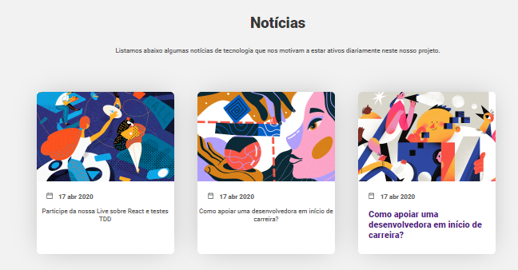
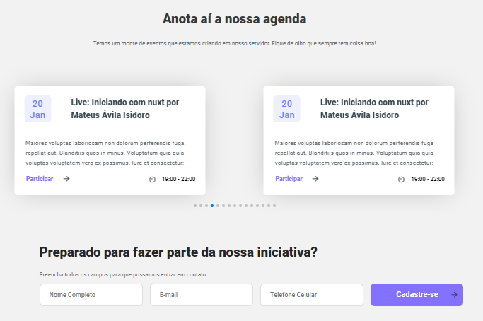

# Desafio Tech-People
## Landing Page do servidor do Discord Pessoas de tech

Para rodar a aplicação com NextJs, instale as dependências com npm

```npm install ```

depois rode o script padrão: 

```npm run dev ```

A aplicação estará rodando na url: localhost:3000





